# 实验一自检报告

生成时间：2026-09-24 01:08（本地时间）  
项目：`se3306-exp1`  
执行命令：`npm.cmd run build`、`npm.cmd run verify`  
测试环境：Node.js 24、Microsoft Edge、Windows、桌面端 `1440×900`、移动端 `390×844`

## 总结

本地代码构建成功，自动化自检 13/13 项通过。截图全部来自本地实际运行页面或实际 HTTP 响应证据。Vercel/Render 线上部署由于没有账号登录和 GitHub 授权，状态为“受阻”，没有生成虚假的线上地址或截图。

## 检查清单

| 检查项 | 预期结果 | 实际结果 | 状态 | 证据 |
| --- | --- | --- | --- | --- |
| CSR 初始 HTML | 不含文章正文 | 未检测到文章正文 | 通过 | [source-csr.png](docs/screenshots/source-csr.png) |
| SSR 初始 HTML | 直接包含 10 篇文章 | 包含 10 篇 | 通过 | [source-ssr.png](docs/screenshots/source-ssr.png) |
| SSG 初始 HTML | 直接包含 10 篇文章 | 包含 10 篇 | 通过 | [source-ssg.png](docs/screenshots/source-ssg.png) |
| SSR 动态渲染时间 | 连续请求时间不同 | `2026-09-23T17:08:14.634Z → 2026-09-23T17:08:14.763Z` | 通过 | [ssr-time-change.png](docs/screenshots/ssr-time-change.png) |
| SSG 固定构建时间 | 连续请求时间相同 | `2026-09-23T17:07:16.095Z = 2026-09-23T17:07:16.095Z` | 通过 | [ssg-time-fixed.png](docs/screenshots/ssg-time-fixed.png) |
| SSR 健康检查 | `status=ok`、`articles=10` | `{"status":"ok","mode":"SSR","articles":10}` | 通过 | `/health` 响应 |
| CSR 桌面端 | 10 篇、图片成功、无错误、无溢出 | 10 篇；图片成功；错误 0；无溢出 | 通过 | [csr-desktop.png](docs/screenshots/csr-desktop.png) |
| CSR 移动端 | 10 篇、图片成功、无错误、无溢出 | 10 篇；图片成功；错误 0；无溢出 | 通过 | [csr-mobile.png](docs/screenshots/csr-mobile.png) |
| SSR 桌面端 | 10 篇、图片成功、无错误、无溢出 | 10 篇；图片成功；错误 0；无溢出 | 通过 | [ssr-desktop.png](docs/screenshots/ssr-desktop.png) |
| SSR 移动端 | 10 篇、图片成功、无错误、无溢出 | 10 篇；图片成功；错误 0；无溢出 | 通过 | [ssr-mobile.png](docs/screenshots/ssr-mobile.png) |
| SSG 桌面端 | 10 篇、图片成功、无错误、无溢出 | 10 篇；图片成功；错误 0；无溢出 | 通过 | [ssg-desktop.png](docs/screenshots/ssg-desktop.png) |
| SSG 移动端 | 10 篇、图片成功、无错误、无溢出 | 10 篇；图片成功；错误 0；无溢出 | 通过 | [ssg-mobile.png](docs/screenshots/ssg-mobile.png) |
| CSR JavaScript 网络请求 | 请求 `assets/main.js` | 已检测到 `assets/main.js` | 通过 | [network-csr.png](docs/screenshots/network-csr.png) |

## 页面截图

### CSR

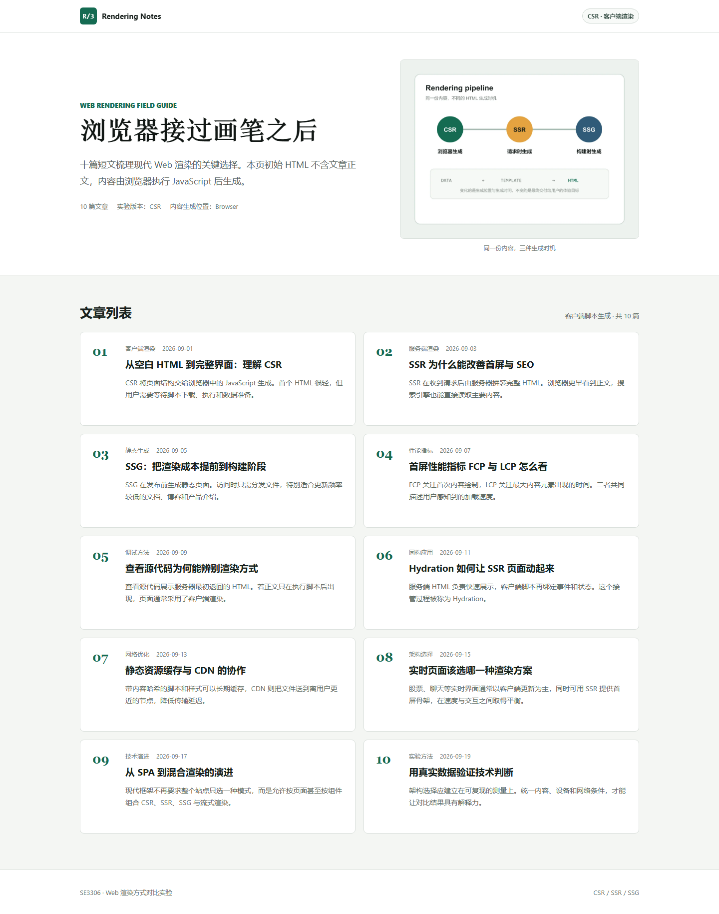

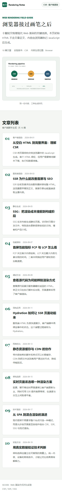

### SSR

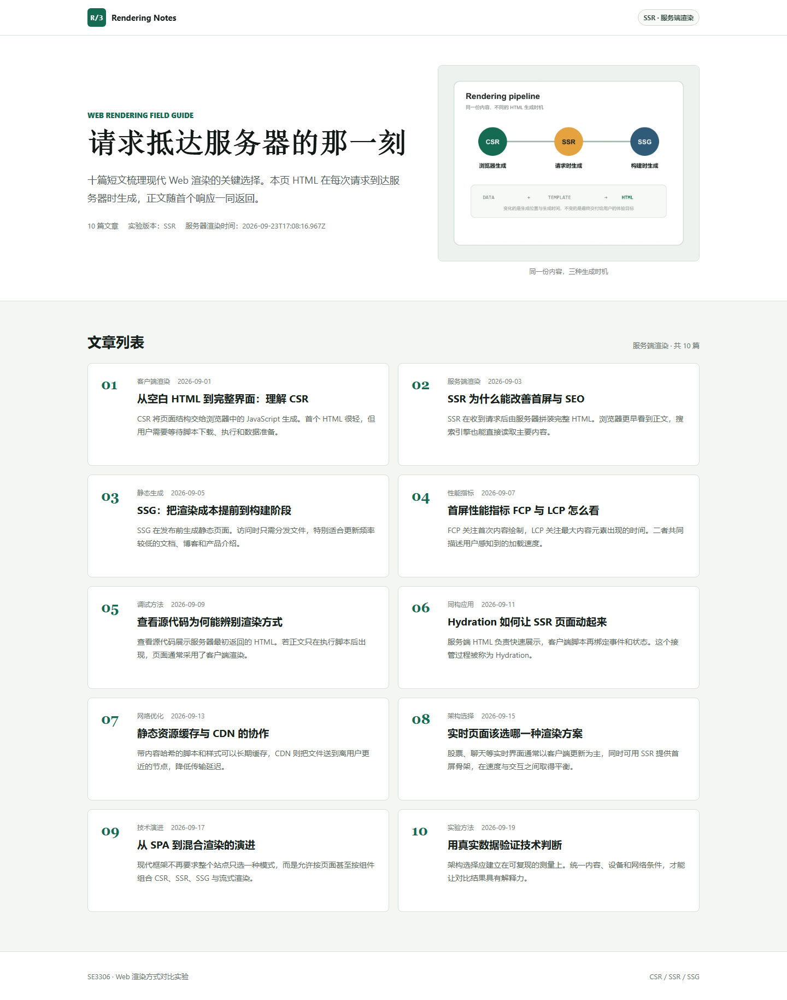

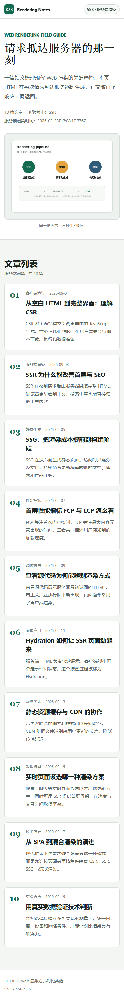

### SSG

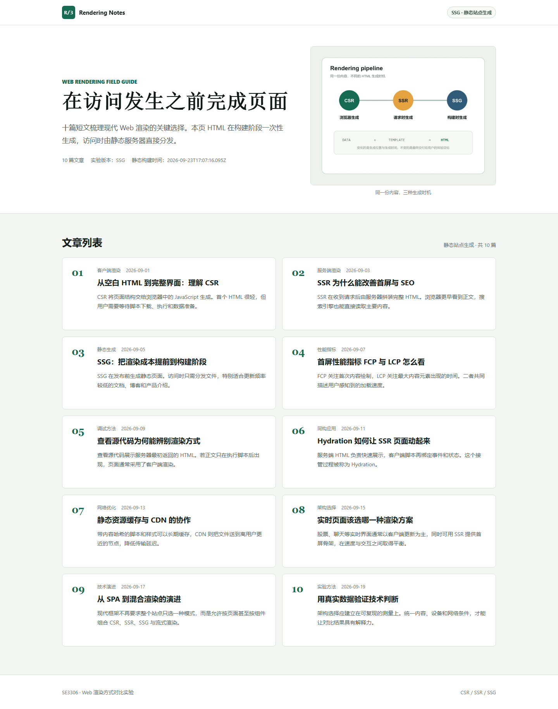

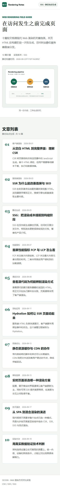

## 渲染机制证据

### CSR 网络请求

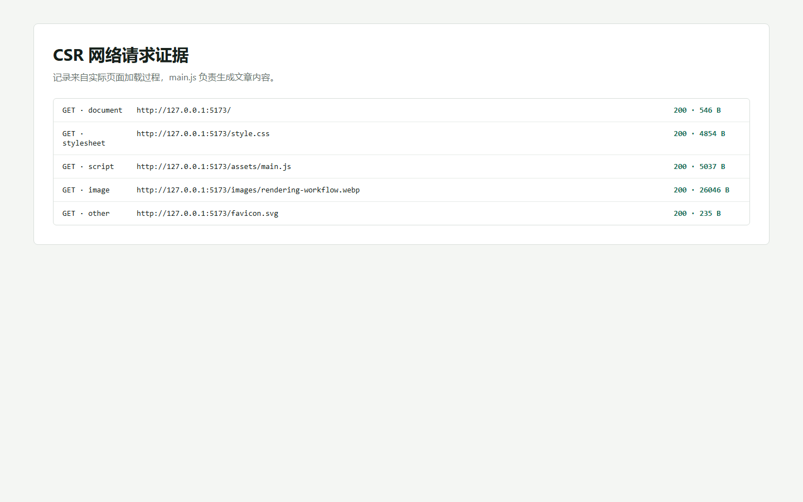

### 初始 HTML 源代码

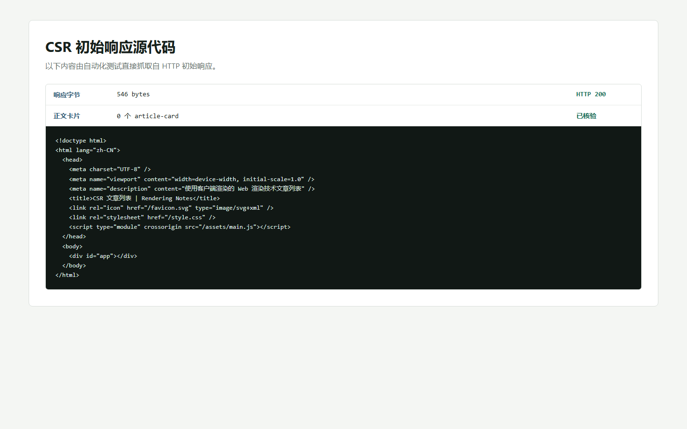

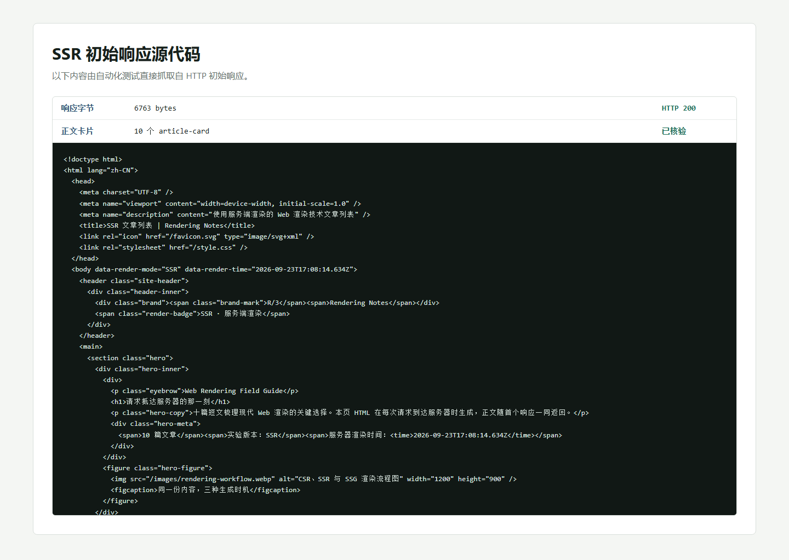

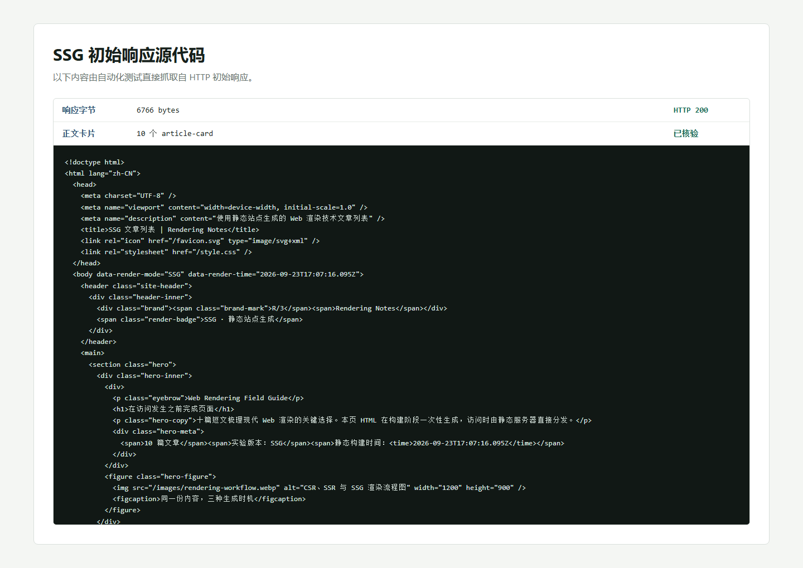

### 动态与固定时间

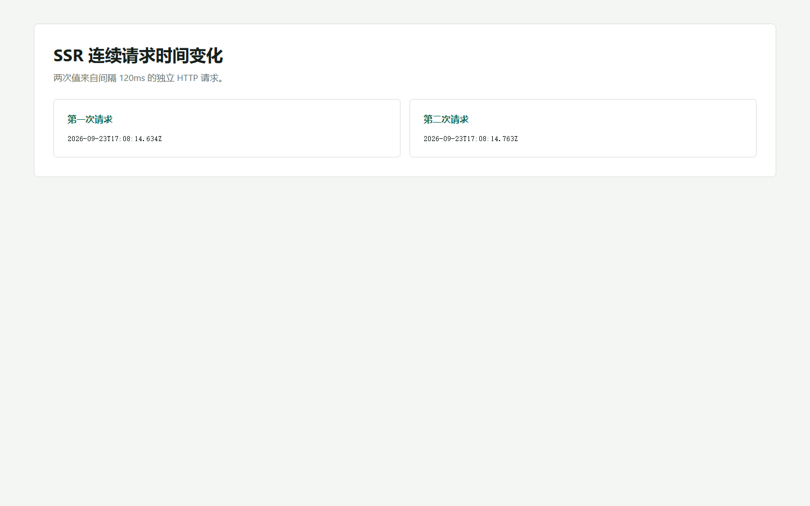

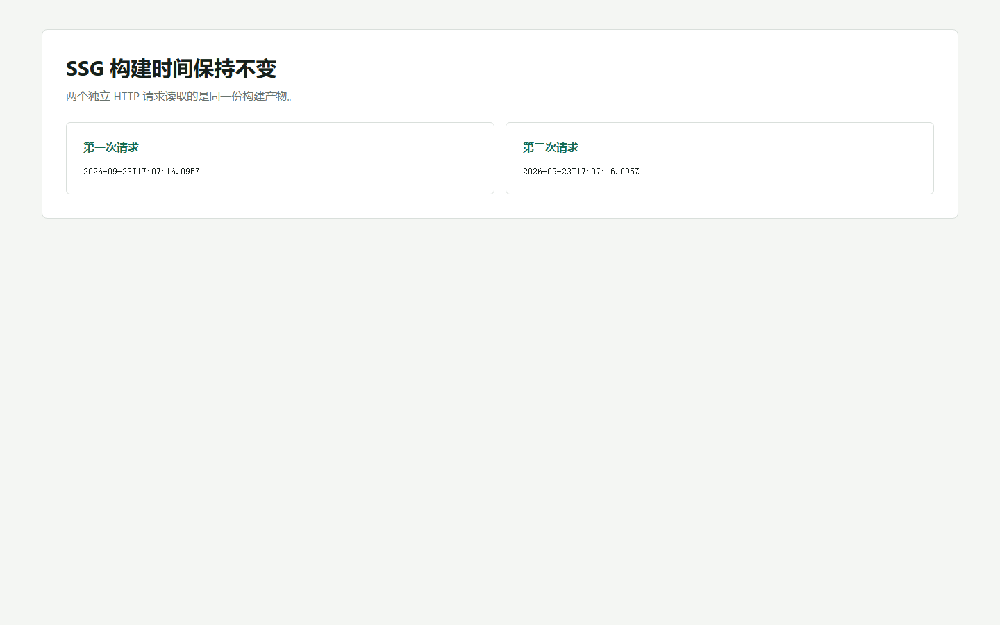

## 性能自检

每种模式使用同一 Microsoft Edge 浏览器、桌面端 `1440×900` 视口连续测试 3 次，报告采用中位数。测试使用浏览器 Performance API 采集 `responseStart`、FCP、LCP，并检查 title、description、h1 和文章语义结构。性能估分仅用于本地对比，不等同于 Lighthouse 官方评分。

| 模式 | 初始 HTML | FCP | LCP | 性能估分 | SEO 信号 |
| --- | ---: | ---: | ---: | ---: | ---: |
| CSR | 546 B | 80 ms | 92 ms | 93 | 100 |
| SSR | 6763 B | 84 ms | 84 ms | 93 | 100 |
| SSG | 6766 B | 96 ms | 96 ms | 92 | 100 |

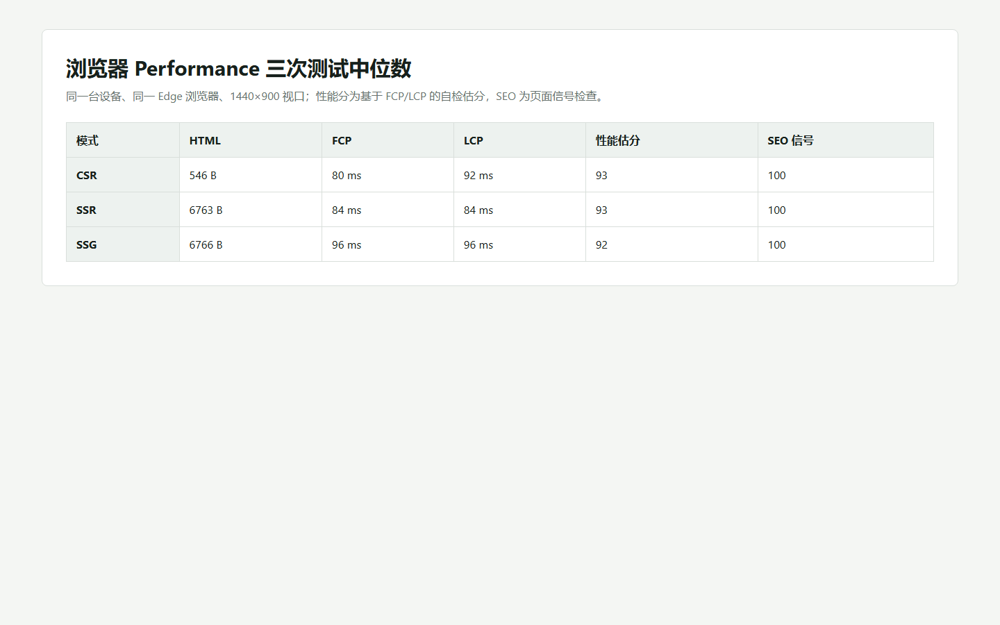

## 部署检查

| 部署项 | 预期结果 | 实际结果 | 状态 | 证据 |
| --- | --- | --- | --- | --- |
| CSR Vercel | 线上公开 URL | 未进行 Vercel 账号授权 | 受阻 | 无 |
| SSG Vercel | 线上公开 URL | 未进行 Vercel 账号授权 | 受阻 | 无 |
| SSR Render | 线上公开 URL，`/health` 可访问 | 未进行 Render 账号授权 | 受阻 | 无 |
| 线上截图 | 三个平台页面截图 | 因没有线上 URL 未执行 | 受阻 | 无 |

部署配置已写入源码：CSR 和 SSG 使用各自的 `vercel.json`，SSR 使用根目录 `render.yaml`。完成账号授权后，可按 README 的部署步骤发布并补充线上 URL 与截图。

## 机器结果

完整机器可读结果保存在 [docs/results.json](docs/results.json)，自动化脚本为 [scripts/verify.mjs](scripts/verify.mjs)。服务输出保存在 `docs/server-output.log`。
